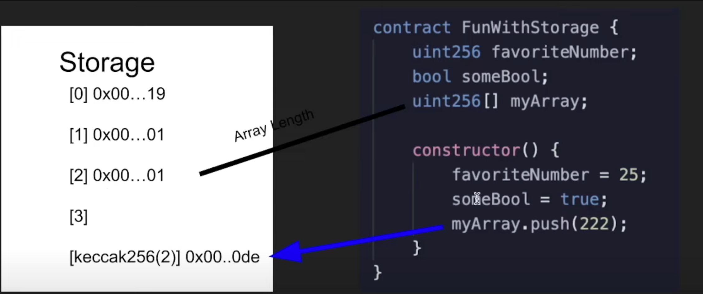

### import openzeppelin
- forge install OpenZeppelin/openzeppelin-contracts --no-commit


### storage
#### slot
- every slot 32 byte
```javascript
// eth_getStorageAt(contractAddress,slot)

var contractAddr="0xe700184a875390d7c98371769315E9A2504Ad556"; 
for(i=0;i<6;i++){
    console.log(web3.eth.getStorageAt(contractAddr,i))
}
// 输出
0x000000000000000000000000000000000000000000000000000000000000000b
0x000000000000000000000000000000000000000000000000000000000000000c
0x000000000000000000000000000000000000000000000000000000000000000d
0x000000000000000000000000000000000000000000000000000000000000000e
0x0000000000000000000000000000000000000000000000000000000000000000
0x0000000000000000000000000000000000000000000000000000000000000000

```

节约gas技巧
- 字段定义顺序， 8，256，8将占用3个slot，256，8，8将占用2个slot
- 默认读取32字节，所以读取小于32字节的数据需要额外的代码，会导致更多gas


#### save
- array: save length to slot, save value to 
- map 
- constant in the code bytes
- functional variable save are temporary

